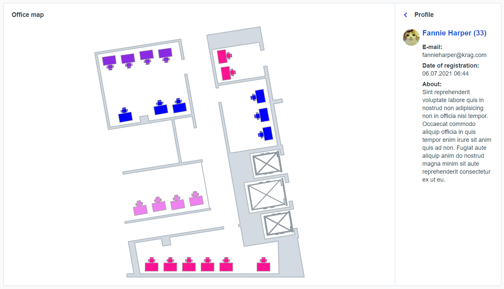
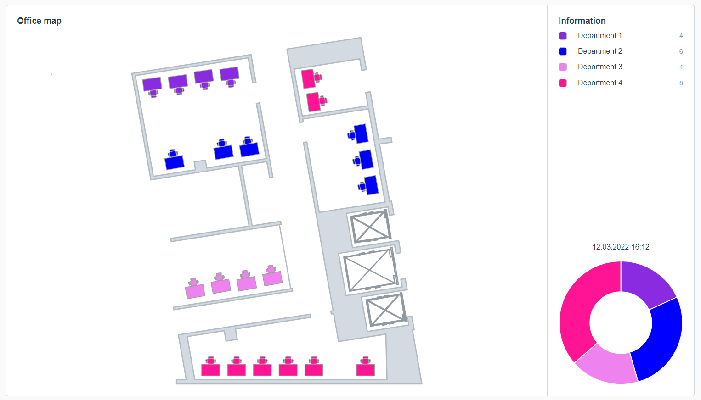

# office-map
## Отрисовка карты офиса и круговой диаграммы Vue.js с использованием библиотек D3.js, vue-chartjs, vuedraggable
- загрузка из JSON информации о расположении рабочих столов сотрудников в соответствии с их подразделением
- отрисовка svg-изображений столов на svg-карте - D3.js
- возможность менять очередность списка подразделения в боковом меню - vuedraggable
- круговая диаграмма с подразделениями компании и количеством занятых мест на карте - vue-chartjs
- форматирование даты - date-fns

